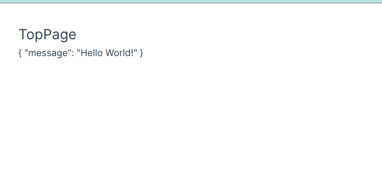

# vue-django
This phase aims to establish API communication between the Vue.js frontend and Django backend. The following features are included in this phase:
- API request: Vue.js will send the specific API request to Django system.
- Reactivity to API response: Vue.js will render the data received from Django in response to the API request.



## Getting started
1. Run django sever for API

Open the terminal and run the following comamnds:
```bash
python manage.py runserver
```

2. Run vue server for frontend

Open other terminal and run the following command:
```bash
npm run dev
```

## References
django-vue: https://qiita.com/ryo-keima/items/aaa3f65524241a418fc9


## Project memo

### Dev server config
Based on the reference website, the devServer configuration should look like this:
```js
const { defineConfig } = require('@vue/cli-service')
module.exports = defineConfig({
  transpileDependencies: true,
  devServer: {
    host: "localhost",
    hot: "only",
    proxy: {
      "^/api": {
        target: "http://localhost:8000",
        changeOrigin: true,
      },
    },
  },
})
```

This configuration is designed for vue/cli, so some modifications are needed to make it work with this project. Vite is used for managing the Vue.js environment in this case. The `vite.config.js` should look like this:
```js
// vite.config.js
// https://vitejs.dev/config/
export default defineConfig({
  plugins: [vue()],
  resolve: {
    alias: {
      '@': fileURLToPath(new URL('./src', import.meta.url))
    }
  },
  server: {
    //host: 'localhost',
    port: 8000,
    //open: false,
    //watch: {
    //  usePolling: true,
    //  disableGlobbing: false,
    //},
    proxy:{
      "^/api": {
        target: "http://localhost:8000",
        changeOrigin: true,
      },
    }
  },
})
```
From my experience, the `port` and `proxy` configurations are essential for the website to work properly.